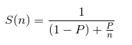

### Escuela Colombiana de Ingeniería
### Arquitecturas de Software - ARSW
## Ejercicio Introducción al paralelismo - Hilos - Caso BlackListSearch


### Dependencias:
####   Lecturas:
*  [Threads in Java](http://beginnersbook.com/2013/03/java-threads/)  (Hasta 'Ending Threads')
*  [Threads vs Processes]( http://cs-fundamentals.com/tech-interview/java/differences-between-thread-and-process-in-java.php)

### Descripción
  Este ejercicio contiene una introducción a la programación con hilos en Java, además de la aplicación a un caso concreto.
  

**Parte I - Introducción a Hilos en Java**

1. De acuerdo con lo revisado en las lecturas, complete las clases CountThread, para que las mismas definan el ciclo de vida de un hilo que imprima por pantalla los números entre A y B.
```java
package edu.eci.arsw.threads;

/**
 * @author Barrios y Castro
 */
public class CountThread extends Thread{
    public int a;
    public int b;

    /***
     * Método constructor de un hilo que cuenta los numero entre a y b.
     * @param a Entero.
     * @param b Entero.
     */
    public CountThread(int a,int b){
        this.a=a;
        this.b=b;
    }

    /***
     * Método para correr el hilo.
     */
    public void run() {
        this.showNumbers(this.a, this.b);
    }

    /***
     * Método en donde se desarrolla el ciclo para ver los números consecutivos.
     * @param a Entero.
     * @param b Entero.
     */
    public void showNumbers(int a, int b) {
        for (int i=this.a; i<=this.b; i++) {
            System.out.println(i);
        }
    }
}
``` 
2. Complete el método __main__ de la clase CountMainThreads para que:
	1. Cree 3 hilos de tipo CountThread, asignándole al primero el intervalo [0..99], al segundo [99..199], y al tercero [200..299].
	```java
	package edu.eci.arsw.threads;
	/**
	 *
	 * @author Barrios y Castro
	 */
	public class CountThreadsMain {
	    public static void main(String a[]){
		CountThread hilo1 = new CountThread(0,99);
		CountThread hilo2 = new CountThread(99,199);
		CountThread hilo3 = new CountThread(200,299);
	    }
	}
	```
	2. Inicie los tres hilos con 'start()'.
	```java
	package edu.eci.arsw.threads;
	/**
	 *
	 * @author Barrios y Castro
	 */
	public class CountThreadsMain {
	    public static void main(String a[]){
		CountThread hilo1 = new CountThread(0,99);
		CountThread hilo2 = new CountThread(99,199);
		CountThread hilo3 = new CountThread(200,299);
		System.out.println("Utilizando el metodo start():");
		hilo1.start();
		hilo2.start();
		hilo3.start();
	    }
	}
	```
	3. Ejecute y revise la salida por pantalla.
	
	
	
	4. Cambie el incio con 'start()' por 'run()'. ¿Cómo cambia la salida? ¿por qué?.
	```java
	package edu.eci.arsw.threads;
	/**
	 *
	 * @author Barrios y Castro
	 */
	public class CountThreadsMain {
	    public static void main(String a[]){
		CountThread hilo1 = new CountThread(0,99);
		CountThread hilo2 = new CountThread(99,199);
		CountThread hilo3 = new CountThread(200,299);
		System.out.println("Utilizando el metodo run():");
		hilo1.run();
		hilo2.run();
		hilo3.run();
	    }
	}
	```
	
	### Output utilizando el método start:
	
	
	
	Se puede presenciar que al ejecutar el método start se estan iniciando todos los hilos concurrentemente.
	
	### Output utilizando el método run:
	
	
	
	Por otra parte, ejecutando el método run se estan iniciando todos los hilos secuencialmente. Por lo tando hasta que no se termine de ejecutar el primer hilo, no se ejecutará el siguiente.
	
	Los dos outputs son diferentes porque al llamar el método run estamos llamando un método como cualquier otro, esto significa como ya lo sustentamos anteriormente que hasta que no termina no se llamará al otro método; por otra parte, el método start ejecuta su procesamiento al mismo tiempo que los otros hilos al inicializarlos.
	
	
**Parte II - Ejercicio Black List Search**


Para un software de vigilancia automática de seguridad informática se está desarrollando un componente encargado de validar las direcciones IP en varios miles de listas negras (de host maliciosos) conocidas, y reportar aquellas que existan en al menos cinco de dichas listas. 

Dicho componente está diseñado de acuerdo con el siguiente diagrama, donde:

- HostBlackListsDataSourceFacade es una clase que ofrece una 'fachada' para realizar consultas en cualquiera de las N listas negras registradas (método 'isInBlacklistServer'), y que permite también hacer un reporte a una base de datos local de cuando una dirección IP se considera peligrosa. Esta clase NO ES MODIFICABLE, pero se sabe que es 'Thread-Safe'.

- HostBlackListsValidator es una clase que ofrece el método 'checkHost', el cual, a través de la clase 'HostBlackListDataSourceFacade', valida en cada una de las listas negras un host determinado. En dicho método está considerada la política de que al encontrarse un HOST en al menos cinco listas negras, el mismo será registrado como 'no confiable', o como 'confiable' en caso contrario. Adicionalmente, retornará la lista de los números de las 'listas negras' en donde se encontró registrado el HOST.


Al usarse el módulo, la evidencia de que se hizo el registro como 'confiable' o 'no confiable' se dá por lo mensajes de LOGs:

INFO: HOST 205.24.34.55 Reported as trustworthy

INFO: HOST 205.24.34.55 Reported as NOT trustworthy


Al programa de prueba provisto (Main), le toma sólo algunos segundos análizar y reportar la dirección provista (200.24.34.55), ya que la misma está registrada más de cinco veces en los primeros servidores, por lo que no requiere recorrerlos todos. Sin embargo, hacer la búsqueda en casos donde NO hay reportes, o donde los mismos están dispersos en las miles de listas negras, toma bastante tiempo.

Éste, como cualquier método de búsqueda, puede verse como un problema [vergonzosamente paralelo](https://en.wikipedia.org/wiki/Embarrassingly_parallel), ya que no existen dependencias entre una partición del problema y otra.

Para 'refactorizar' este código, y hacer que explote la capacidad multi-núcleo de la CPU del equipo, realice lo siguiente:

1. Cree una clase de tipo Thread que represente el ciclo de vida de un hilo que haga la búsqueda de un segmento del conjunto de servidores disponibles. Agregue a dicha clase un método que permita 'preguntarle' a las instancias del mismo (los hilos) cuantas ocurrencias de servidores maliciosos ha encontrado o encontró.

```java
package edu.eci.arsw.threads;

import edu.eci.arsw.spamkeywordsdatasource.HostBlacklistsDataSourceFacade;
import java.util.LinkedList;

public class HostBlackListThread<checkHost> extends Thread {
    private HostBlacklistsDataSourceFacade skds;
    private int x;
    private int y;
    private String ipaddress;
    private int occurrencesCount;
    private LinkedList<Integer> blackListOcurrences;
    private int checkedListsCount = 0;

    /***
     * Método constructor de un hilo que hace la búsqueda de una dirección IP dentro de
     * un segmento del conjunto de servidores disponibles.
     * @param skds Objeto que contiene la información de todos los servidores disponibles.
     * @param x Limite inferior del intervalo de servidores que se va a revisar.
     * @param y Limite superior del intervalo de servidores que se va a revisar.
     * @param ipaddress Dirección IP que se desea buscar.
     */
    public HostBlackListThread(HostBlacklistsDataSourceFacade skds,int x, int y,String ipaddress){
        this.skds = skds;
        this.x = x;
        this.y = y;
        this.ipaddress = ipaddress;
        blackListOcurrences = new LinkedList<>();
    }

    /***
     * Método para correr el hilo, tiene el ciclo que realizará la busqueda en cada uno de los
     * servidores del intervalo.
     */
    @Override
    public void run() {
        for (int i = x; i < y && occurrencesCount < 5; i++) {
            checkedListsCount++;
            if (skds.isInBlackListServer(i, ipaddress)) {
                blackListOcurrences.add(i);
                occurrencesCount++;
            }
        }
    }

    /***
     * Retorna el número de veces que la dirección IP se encontró en los servidores dados.
     * @return El número de ocurrencias de la dirección IP en los servidores dados.
     */
    public int getOccurrencesCount() { return occurrencesCount; }

    /***
     *Retorna el número de listas que se han revisado.
     * @return El número de listas que se han revisado.
     */
    public int getCheckedListsCount(){ return checkedListsCount; }

    /***
     * Retorna el número que identifica a las listas de servidores donde se tienen ocurrencias de
     * la dirección IP dada.
     * @return El número que identifica a las listas de servidores donde se tienen ocurrencias de
     * la dirección IP dada.
     */
    public LinkedList<Integer> getBlackListOccurrences() { return blackListOcurrences; }
}
```

2. Agregue al método 'checkHost' un parámetro entero N, correspondiente al número de hilos entre los que se va a realizar la búsqueda (recuerde tener en cuenta si N es par o impar!). Modifique el código de este método para que divida el espacio de búsqueda entre las N partes indicadas, y paralelice la búsqueda a través de N hilos. Haga que dicha función espere hasta que los N hilos terminen de resolver su respectivo sub-problema, agregue las ocurrencias encontradas por cada hilo a la lista que retorna el método, y entonces calcule (sumando el total de ocurrencuas encontradas por cada hilo) si el número de ocurrencias es mayor o igual a _BLACK_LIST_ALARM_COUNT_. Si se da este caso, al final se DEBE reportar el host como confiable o no confiable, y mostrar el listado con los números de las listas negras respectivas. Para lograr este comportamiento de 'espera' revise el método [join](https://docs.oracle.com/javase/tutorial/essential/concurrency/join.html) del API de concurrencia de Java. Tenga también en cuenta:

```java
/**
* Check the given host's IP address in all the available black lists,
* and report it as NOT Trustworthy when such IP was reported in at least
* BLACK_LIST_ALARM_COUNT lists, or as Trustworthy in any other case.
* The search is not exhaustive: When the number of occurrences is equal to
* BLACK_LIST_ALARM_COUNT, the search is finished, the host reported as
* NOT Trustworthy, and the list of the five blacklists returned.
* @param ipaddress suspicious host's IP address.
* @return  Blacklists numbers where the given host's IP address was found.
*/
public List<Integer> checkHost(String ipaddress,int n){
	HostBlacklistsDataSourceFacade skds = HostBlacklistsDataSourceFacade.getInstance();

	LinkedList<Integer> blackListOccurrences;
	LinkedList<Integer> globalBlackListOccurrences = new LinkedList<>();
	LinkedList<HostBlackListThread> threads = new LinkedList<>();

	int globalOccurrencesCount = 0;
	int checkedListsCount = 0;
	int serversNumber = skds.getRegisteredServersCount()/n;
	int cont = 0;

	for (int i = 0; i < n; i++){
	    threads.add(new HostBlackListThread(skds, cont, cont + serversNumber, ipaddress));
	    cont = cont + serversNumber;
	}

	for(HostBlackListThread hilo : threads){
	    hilo.start();
	}

	for(HostBlackListThread hilo : threads){
	    try {
		hilo.join();
	    } catch (InterruptedException e) {
		e.printStackTrace();
	    }
	    if (globalOccurrencesCount < BLACK_LIST_ALARM_COUNT){
		globalOccurrencesCount = globalOccurrencesCount + hilo.getOccurrencesCount();
		checkedListsCount= checkedListsCount + hilo.getCheckedListsCount();
		blackListOccurrences = hilo.getBlackListOccurrences();
		for(Integer hostList : blackListOccurrences){
		    globalBlackListOccurrences.add(hostList);
		}
	    }else{
		break;
	    }
	}

	if (globalOccurrencesCount >= BLACK_LIST_ALARM_COUNT){
	    skds.reportAsNotTrustworthy(ipaddress);
	}
	else{
	    skds.reportAsTrustworthy(ipaddress);
	}

	LOG.log(Level.INFO, "Checked Black Lists:{0} of {1}", new Object[]{checkedListsCount, skds.getRegisteredServersCount()});

	return globalBlackListOccurrences;
}
```

* Dentro del método checkHost Se debe mantener el LOG que informa, antes de retornar el resultado, el número de listas negras revisadas VS. el número de listas negras total (línea 60). Se debe garantizar que dicha información sea verídica bajo el nuevo esquema de procesamiento en paralelo planteado.

Teniendo en cuenta lo apreciado en la imagen, podemos concluir que en la búsqueda del host 200.24.34.55, que es un host poco disperso, se tuvo que revisar un número reducido de listas.


Por el contrario, para buscar el host 202.24.34.55, que está reportado de una manera más dispersa en las listas, se tuvo que revisar un número bastante elevado de listas.


* Se sabe que el HOST 202.24.34.55 está reportado en listas negras de una forma más dispersa, y que el host 212.24.24.55 NO está en ninguna lista negra.


Para buscar el host 212.24.24.55, se revisaron todas las listas ya que no existe en ninguna de ellas, esto demuestra la veracidad del LOG que informa las listas revisadas.


**Parte II.I Para discutir la próxima clase (NO para implementar aún)**

La estrategia de paralelismo antes implementada es ineficiente en ciertos casos, pues la búsqueda se sigue realizando aún cuando los N hilos (en su conjunto) ya hayan encontrado el número mínimo de ocurrencias requeridas para reportar al servidor como malicioso. ¿Cómo se podría modificar la implementación para minimizar el número de consultas en estos casos? ¿qué elemento nuevo traería esto al problema?

Una estrategia a implementar para la solucion de este problema es el uso de variables de la clase AtomicInteger, las cuales son variables multiproceso con las que se puede llevar la misma cuenta de las ocurrencias del host que se valida entre todos los hilos. Ya que en la anterior implementación se realiza una búsqueda exhaustiva que es innecesaria. 

**Parte III - Evaluación de Desempeño**

A partir de lo anterior, implemente la siguiente secuencia de experimentos para realizar las validación de direcciones IP dispersas (por ejemplo 202.24.34.55), tomando los tiempos de ejecución de los mismos (asegúrese de hacerlos en la misma máquina):

1. Un solo hilo.


2. Tantos hilos como núcleos de procesamiento (haga que el programa determine esto haciendo uso del [API Runtime](https://docs.oracle.com/javase/7/docs/api/java/lang/Runtime.html)).


3. Tantos hilos como el doble de núcleos de procesamiento.


4. 50 hilos.


5. 100 hilos.


Al iniciar el programa ejecute el monitor jVisualVM, y a medida que corran las pruebas, revise y anote el consumo de CPU y de memoria en cada caso. 

Con lo anterior, y con los tiempos de ejecución dados, haga una gráfica de tiempo de solución vs. número de hilos. Analice y plantee hipótesis con su compañero para las siguientes preguntas (puede tener en cuenta lo reportado por jVisualVM):


1. Según la [ley de Amdahls](https://www.pugetsystems.com/labs/articles/Estimating-CPU-Performance-using-Amdahls-Law-619/#WhatisAmdahlsLaw?):

	, donde _S(n)_ es el mejoramiento teórico del desempeño, _P_ la fracción paralelizable del algoritmo, y _n_ el número de hilos, a mayor _n_, mayor debería ser dicha mejora. Por qué el mejor desempeño no se logra con los 500 hilos?, cómo se compara este desempeño cuando se usan 200?. 
	
	La ley de Amdahl establece que la mejora incremental en la aceleración conseguida con la mejora de una parte se va reduciendo a medida que se van introduciendo nuevas 	mejoras, es decir, cuando el numero de hilos tienden al infinito el aporte en el tiempo de ejecución al seguir incrementado el numero de hilos se vuelve insignificante.
	
2. ¿Cómo se comporta la solución usando tantos hilos de procesamiento como núcleos comparado con el resultado de usar el doble de éste?.

	En nuestro caso, utilizando un computador de dos nucleos cuando ejecutamos el programa con 2 hilos, este tarda en ejecutarse 1 minuto con 14 segundos; al usar el doble, es decir, 8 hilos se evidencia que el tiempo es de 37 segundos, concluyendo que se reduce a la mitad.

3. De acuerdo con lo anterior, si para este problema en lugar de 100 hilos en una sola CPU se pudiera usar 1 hilo en cada una de 100 máquinas hipotéticas, la ley de Amdahls se aplicaría mejor?. ¿Si en lugar de esto se usaran c hilos en 100/c máquinas distribuidas (siendo c es el número de núcleos de dichas máquinas), se mejoraría?. Explique su respuesta.

	La ley de Amdahls se aplicaría de una manera menos óptima, ya que no habría una mejora en el desempeño porque al momento de combinar los resultados de cada una de las diferentes máquinas se consumen recursos físicos que provocan una menor eficiencia en nuestro programa.

### Conclusión

Con ayuda de esta tabla donde se presentan los valores obtenidos de las pruebas realizadas en la parte 2 y la mejora en el desempeño de ejecución, se desarrolló la siguiente gráfica:


Para finalmente corroborar que aumentando el número de hilos se llega a un límite de procesamiento, donde la mejora en el desempeño se vuelve constante. Esto es limitado por el hardware en que se ejecute el programa ya que cuando la cantidad de hilos excede por más del doble la cantidad de procesadores de la CPU, el tiempo se vuelve constante en vez de reducirse más.

## Autores
- [Federico Barrios Meneses](https://github.com/federico29)
- [Guillermo Alfonso Castro Camelo](https://github.com/memo1019)

## Licencias
- Este proyecto está bajo la Licencia GNU General Public License - [LICENSE](/LICENSE.txt)
